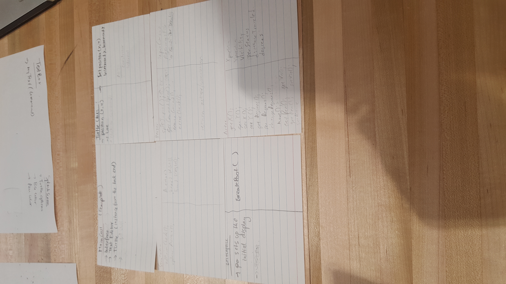

Joy Kim (jmk77@duke.edu)

Ted Marchildon (tmm61@duke.edu)

Pratiksha Sharma (ps179@duke.edu)

Vincent Zhang (vwz2@duke.edu)

SLogo Discussion
=====

When does parsing need to take place and what does it need to start properly? 
* When the user types into the textfield, send it over to backend. It needs to send over the string input.

Result of parsing and who receives it
* The command and inputs (parameter), received by the error checking process that eventually sends it to the backend

When are errors detected?
* Right after being parsed in the backend. Some sort of error message would be sent up to the display

When do commands know, when do they know it, and how do they get it?
* Commands know their command and their inputs. They know it during error checking. They get it through a resource file. Provides what the inputs are

How is the GUI updated after a command has completed execution?
* Retrieve the position of the actor (turtle) and draw it using JavaFX API.

General Classes

**classes that are commented have all their methods of that type**

package cells;

public class AntsCell extends Cell { **internal API (all methods in class- internally used class)**

  	public AntsCell(int state, String shapeID, int food, int max) 
  	
	public AntsCell(int a, String shapeID) 
	
	public void decayPheromones(double pheromoneDecayRate) 
	
	public double getPhermones(int type) 
	
	public double getMax() 
	
	public void topOffPheromones(int type) 
	
	public double getNumAnts() return numAnts;}
	
	public void addAnt(Ant a) ants.add(a);numAnts++;} 
	
	public void removeAnt(Ant a) ants.remove(a);numAnts--;}
	
	public boolean isHome() return state == HOME_STATE;}
	
	public boolean isFood() return state == FOOD_STATE;}
	
	public boolean isGround() return state == GROUND_STATE;}
	
	public boolean outOfFood() return food <= 0;}
	
	public void loseFood(double i) food-=i;}
	
	public void gainFood(double i) food+=i;}
	
	public double getFood() return food;}
	
	public ArrayList<Ant> getAnts() return ants;}
}
 
package cells;

public abstract class Cell { 

  	public Cell(int i, String shapeID) ** INTERNAL **
  	
	public Paint getColor() ** external **
	
	public void addNeighbor(Cell c) ** internal ** 
	
	public int getState() 
	
	public boolean isState(int i) ** should not be included **
	
	public void setState(int i) ** external **
	
	public void setShape(String s) ** external ** 
	
	public Node getShape()
	
	public ArrayList<Cell> getNeighbors()  ** internal ** 
	
	public ArrayList<Cell> getAdjNeighbors() ** internal** 
	
	public void addAdjNeighbor(Cell c) ** internal **
	
	public void setNeighbors(ArrayList<Cell> n) ** internal **
	
	public int getNumStates() ** external **
}
 
package cells;

public abstract class CellShape {
** external **
  	public Node getNode()
  	
	public void setColor(Color c)
	
	public Paint getColor()
}
 
package cells;

public class FireCell extends Cell { 
** internal **

  	public FireCell(int i, String shapeID)
}
 
package cells;

public class GameOfLifeCell extends Cell{ 
** internal **

  	public GameOfLifeCell(int i, String shapeID)
  	
	public void setLiving(boolean b) 
	
	public boolean isLiving() 
}
 
package cells;

public class Hexagon extends CellShape { 
** external **

  	public Hexagon(Paint color)
  	
	public Node getNode()
	
	public void setColor(Color c)
}
 
package cells;

public class SegregationCell extends Cell{ 
** internal **

  	public SegregationCell(int i, String shapeID)
}
 
package cells;

public class SlimeCell extends Cell { 
** internal **

  	public SlimeCell(String shapeID) 
  	
	public SlimeCell(String shapeID, int chem, SlimeMold mold) 
	
	public void decayChemicals(int i) 
	
	public void addChemicals(int i) 
	
	public int getChemicals() return chemicals;}
	
	public boolean hasMold() return myMold != null;}
	
	public SlimeMold getSlimeMold() return myMold == null ? new SlimeMold() : myMold;}
	
	public void removeSlimeMold() myMold = null;}
	
	public void addSlimeMold(SlimeMold m) myMold = m;}
	
	public void setColor() 
}
 
package cells;

public class Square extends CellShape{ 
** external **

  	public Square(int size, Paint color)
  	
	public Square(int size)
	
	public Node getNode()
	
	public void setColor(Color c)
	
	public void setSize(int size)
}
 
package cells;
public class SugarScapeCell extends Cell { 
** internal **

  	public SugarScapeCell(String shapeID, int maxS, int s)
  	
	public void growBackSugar(int s) 
	
	public void agentEatOrDie() 
	
	public SugarScapeAgent removeAgent() 
	
	public int getSugar() return sugar;}
	
	public boolean hasAgent() return agent != null;}
	
	public SugarScapeAgent getAgent() return agent;}
	
	public void addAgent(SugarScapeAgent a) 
}
 
package cells;

public class Triangle extends CellShape{ 
** external **

  	public Triangle(Paint color) 
  	
	public Node getNode()
	
	public void setColor(Color c)
}
 
package cells;

public class Wa_TorCell extends Cell { 
** internal**

  	public Wa_TorCell(int i, String shapeID)
  	
	public void setState(int i) 
	
	public void setState(int i, int e) 
	
	public void resetCycles() cyclesSinceBaby = 0;}
	
	public int getCycles() return cyclesSinceBaby;}
	
	public void addACycle() cyclesSinceBaby++;}
	
	public void setCycle(int c) cyclesSinceBaby = c;}
	
	public void addEnergy(int e) energy += e;}
	
	public void loseEnergy() energy--;}
	
	public boolean isDead() return energy<=0;}
	
	public int getEnergy() return energy;}
}
 
package cellsociety_team09;

public class Ant { 
** should not be public **

  	public Ant() 
  	
	public Ant(int d) 
	
	public boolean goingToFood() return !food;}
	
	public boolean goingToHome() return food;}
	
	public void depositFood() food = false;}
	
	public void grabFood() food = true;}
	
	public int getDirection() return direction;}
	
	public void setDirection(int d) direction = d;}
}
 
package cellsociety_team09;

public class AntReader extends FileReader { 
** internal **

  	public AntReader(String filename) throws XMLFileException 
  	
	public int getpDecayRate() 
	
	public int getfDecayRate() 
}
 
package cellsociety_team09;

public class Ants extends Model { 
** internal **

  	public Ants() 
  	
	public Ants(int pDR, int fDR) 
	
	public Cell[][] update(Cell[][] g) 
	
	public void setPheromoneDecayRate(double i) pheromoneDecayRate=i;}
	
	public double getPheromoneDecayRate() return pheromoneDecayRate;}
	
	public void setFoodDecayRate(double i) foodDecayRate=i;}
	
	public double getFoodDecayRate() return foodDecayRate;}
	
	public List<Double> getHomeFoodCountList() 
}
 
package cellsociety_team09;

public class AntsGrid extends Grid { 
** internal to front-end **

  	public AntsGrid(int m, int n, String shapeID, String edgeType, int[][] states, Model game) 
}
 
package cellsociety_team09;

public class FileReader { 
** internal? **

  	public FileReader(String filename) 
  	
	public String getName() 
	
	public String setName(String newName)
	
	public int getNumRows() 
	
	public int getNumCols() 
	
	public String getShape() 
	
	public String getEdgeType() 
	
	public boolean isTitleValid() throws XMLFileException
	
	public void createErrorWindow(Exception e) 
	
	public int getNumSliders() 
	
	public double getInputMax() 
	
	public Document getDocument() 
	
	public int[][] getStates() 
	
	public int[][] getMold() 
}
 
package cellsociety_team09;

public class Fire extends Model{ 
** internal **

  	public void setSpreadChance(double sp) spreadChance = sp;}
  	
	public Fire() 
	
	public Fire(double sp) 
	
	public Cell[][] update(Cell[][] g) 
	
	public List<Integer> getBurningStateCountList() 
	
	public List<Integer> getTreeStateCountList() 
	
	public List<Integer> getEmptyStateCountList() 
}
 
package cellsociety_team09;
public class FireGrid extends Grid { 
  	public FireGrid(int m, int n, String shapeID, String edgeType, int[][] states, Model game) 
}
 
package cellsociety_team09;
public class FireReader extends FileReader{ 
  	public FireReader(String filename) throws XMLFileException 
	public double getSpreadChance() 
}
 
package cellsociety_team09;
public class GameOfLife extends Model { 
  	public GameOfLife() 
	public Cell[][] update(Cell[][] g) 
	public List<Integer> getAliveStateCountList() 
	public List<Integer> getDeadStateCountList() 
}
 
package cellsociety_team09;
public class GameOfLifeGrid extends Grid { 
  	public GameOfLifeGrid(int m, int n, String shapeID, String edgeType, int[][] states, Model game)
}
 
package cellsociety_team09;
public class GameOfLifeReader extends FileReader { 
  	public GameOfLifeReader(String filename) throws XMLFileException 
}
 
package cellsociety_team09;
public abstract class Grid { 
  	public Grid(int m, int n, String shapeID, String edgeType, int[][] states, Model game) 
	public Grid(int m, int n, int maxSugar, String shapeID, String edgeType, int[][] states, int[][] special, Model game)
	public Grid(int m, int n, String shapeID, String edgeType, int[][] states, int[][] special, Model game)
	public void setShape(String shape) 
	public String getShape() 
	public String getEdgeType() 
	public void setEdge(String edge) 
	public GridPane getGridNode() 
	public Cell getCell(int row, int col) 
	public void updateGridCells() 
	public void update() 
}
 
package cellsociety_team09;
public class Main extends Application { 
  	public void start(Stage s) throws Exception 
}
 
package cellsociety_team09;
public abstract class Model { 
  }
 
package cellsociety_team09;
public class NeighborManager { 
  	public void getNeighbors(Cell[][] cells, String edgeType)
	public void clearNeighbors(Cell[][] cells)
}
 
package cellsociety_team09;
public class Segregation extends Model { 
  	public void setThreshold(double f) segregationThreshold = f;}
	public Segregation() 
	public Segregation(double sT) 
	public Cell[][] update(Cell[][] g) 
	public List<Integer> getMoveCountList() 
}
 
package cellsociety_team09;
public class SegregationGrid extends Grid { 
  	public SegregationGrid(int m, int n, String shapeID, String edgeType, int[][] states, Model game) 
}
 
package cellsociety_team09;
public class SegregationReader extends FileReader { 
  	public SegregationReader(String filename) throws XMLFileException 
	public double getSegregationThreshold() 
}
 
package cellsociety_team09;
public class Slime extends Model{ 
  	public Slime() 
	public Slime(int cDR, int cAR) 
	public Cell[][] update(Cell[][] g) 
	public void setChemicalDecayRate(int rate)chemicalDecayRate = rate;}
	public void setChemicalAddRate(int rate)chemicalAddRate = rate;}
	public List<Integer> getChemicalCountList() 
}
 
package cellsociety_team09;
public class SlimeGrid extends Grid { 
  	public SlimeGrid(int m, int n, String shapeID, String edgeType, int[][] states, int[][] special, Model game) 
}
 
package cellsociety_team09;
public class SlimeMold { 
  	public SlimeMold() 
	public SlimeMold(int d) 
	public int getDirection() return direction;}
	public void setDirection(int d) direction = d;}
}
 
package cellsociety_team09;
public class SlimeReader extends FileReader { 
  	public SlimeReader(String filename) throws XMLFileException 
	public int[][] getStates() 
	public int[][] getMold() 
}
 
package cellsociety_team09;
public class SugarScape extends Model{ 
  	public Cell[][] update(Cell[][] g) 
	public int getSugarGrowBackRate() return sugarGrowBackRate;}
	public void setSugarGrowBackRate(int s) sugarGrowBackRate = s;}
	public int getSugarGrowBackInterval() return sugarGrowBackInterval;}
	public void setSugarGrowBackInterval(int s) sugarGrowBackInterval = s;}
	public int getIntervalCycleCounter() return intervalCycleCounter;}
	public void setIntervalCycleCounter(int i) intervalCycleCounter = i;}
	public List<Integer> getTotalSugarCountList()return totalSugarCountList;}
}
 
package cellsociety_team09;
public class SugarScapeAgent { 
  	public SugarScapeAgent(int vis, int startingS, int sugarM) 
	public boolean isDead() return sugar<=0;}
	public int getVision() return vision;}
	public void eat(int s) sugar += s;}
	public void metabolize() sugar -= sugarMetabolism;}
}
 
package cellsociety_team09;
public class SugarScapeGrid extends Grid { 
  	public SugarScapeGrid(int m, int n, int maxS, String shapeID, String edgeType, int[][] states, int[][] special, Model game) 
}
 
package cellsociety_team09;
public class SugarScapeReader extends FileReader { 
  	public SugarScapeReader(String filename) throws XMLFileException 
	public int[][] getSugar() 
	public int[][] getAgents() 
	public int getMaxSugar() 
}
 
package cellsociety_team09;
public class Wa_Tor extends Model { 
  	public Wa_Tor() 
	public Wa_Tor(int fRR, int sRR, int fE, int sE) 
	public Cell[][] update(Cell[][] g) 
	public List<Integer> getSharkStateCountList() 
	public List<Integer> getFishStateCountList() 
	public List<Integer> getWaterStateCountList() 
	public void setFishEnergy(int f) fishEnergy = f;}
	public void setStartingEnergy(int sE) startingEnergy = sE;}
	public void setSharkReproductionRate(int sRR) sharkReproductionRate = sRR;}
	public void setFishReproductionRate(int fRR) fishReproductionRate = fRR;}
	public int getStartingEnergy() return startingEnergy;}
}
 
package cellsociety_team09;
public class Wa_TorGrid extends Grid { 
  	public Wa_TorGrid(int m, int n, String shapeID, String edgeType, int[][] states, Model game) 
}
 
package cellsociety_team09;
public class Wa_TorReader extends FileReader { 
  	public Wa_TorReader(String filename) throws XMLFileException 
	public int getSharkRepRate() 
	public int getFishRepRate() 
	public int getFishEnergy() 
	public int getStartingEnergy() 
}
 
package cellsociety_team09;
public class XMLFileException extends Exception { 
  	public XMLFileException(String message) 
	public XMLFileException(Throwable cause) 
	public XMLFileException(String message, Throwable cause) 
	public XMLFileException(String message, Throwable cause, boolean enableSuppression, boolean writableStackTrace) 
}
 
package displays;
public class AntsChart extends StateLineChart { 
  	public AntsChart(Model game)
}
 
package displays;
public class AntsDisplay extends Display implements GridInterface { 
  	public AntsDisplay()
	public void resetGrid(int rows, int cols, String shapeID, String edgeType, int[][] states) 
}
 
package displays;
public abstract class Display implements GridInterface { 
  	public Scene init(String filename, Stage s) throws XMLFileException
	public void determineScene(Stage s, String filename) throws XMLFileException 
}
 
package displays;
public class FireChart extends StateLineChart { 
  	public FireChart(Model game) 
}
 
package displays;
public class FireDisplay extends Display implements GridInterface { 
  	public FireDisplay() 
	public void resetGrid(int rows, int cols, String shapeID, String edgeType, int[][] states) 
}
 
package displays;
public class GameOfLifeChart extends StateLineChart { 
  	public GameOfLifeChart(Model game) 
}
 
package displays;
public class GameOfLifeDisplay extends Display implements GridInterface { 
  	public GameOfLifeDisplay()
	public void resetGrid(int rows, int cols, String shapeID, String edgeType, int[][] states) 
}
 
package displays;
 public interface GridInterface {
  }
 
package displays;
public class SegregationChart extends StateLineChart { 
  	public SegregationChart(Model game) 
}
 
package displays;
public class SegregationDisplay extends Display implements GridInterface { 
  	public SegregationDisplay() 
	public void resetGrid(int rows, int cols, String shapeID, String edgeType, int[][] states) 
}
 
package displays;
public class SlimeChart extends StateLineChart { 
  	public SlimeChart(Model game) 
}
 
package displays;
public class SlimeDisplay extends Display implements GridInterface { 
  	public SlimeDisplay() 
	public void resetGrid(int rows, int cols, String shapeID, String edgeType, int[][] states) 
}
 
package displays;
public abstract class StateLineChart { 
  }
 
package displays;
public class SugarScapeChart extends StateLineChart { 
  	public SugarScapeChart(Model game) 
}
 
package displays;
public class SugarScapeDisplay extends Display implements GridInterface { 
  	public SugarScapeDisplay()
	public void resetGrid(int rows, int cols, String shapeID, String edgeType, int[][] states) 
}
 
package displays;
public class Wa_TorChart extends StateLineChart { 
  	public Wa_TorChart(Model game) 
}
 
package displays;
public class Wa_TorDisplay extends Display implements GridInterface { 
  	public Wa_TorDisplay()
	public void resetGrid(int rows, int cols, String shapeID, String edgeType, int[][] states) 
}